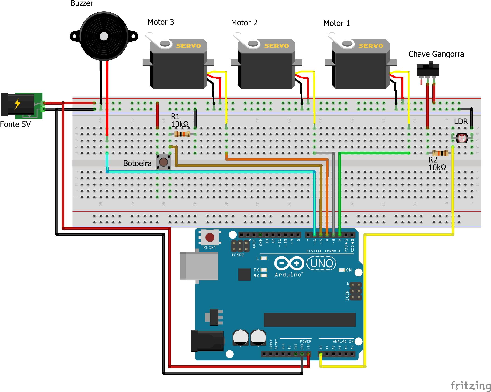

# DOBRAMATIC

Projeto de inovação realizado no curso Técnico em Eletrônica no SENAI. O DOBRAMATIC é um dobrador de camisas automático que pode ser acionado por um sensor ou manualmente através de um botão.

## Circuito

A imagem a seguir mostra o esquema de ligação dos componentes.

## Vídeo demonstração

https://github.com/ramonVSCorrea/dobramatic/assets/99370353/3a3b6727-f3b7-4650-be16-1e03c6594265

